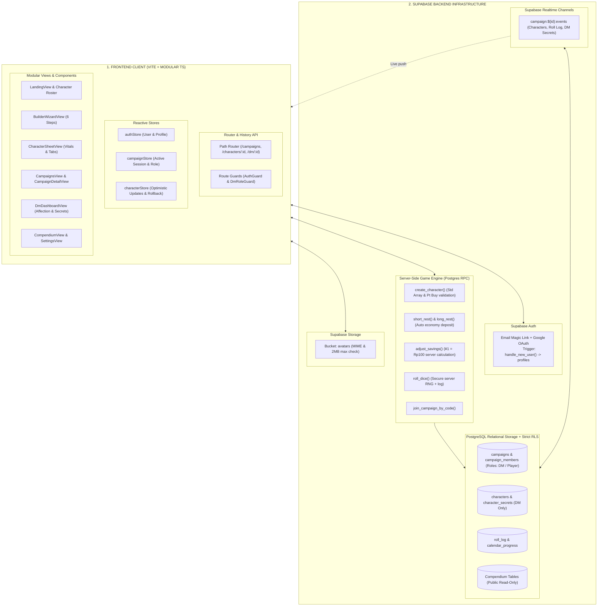
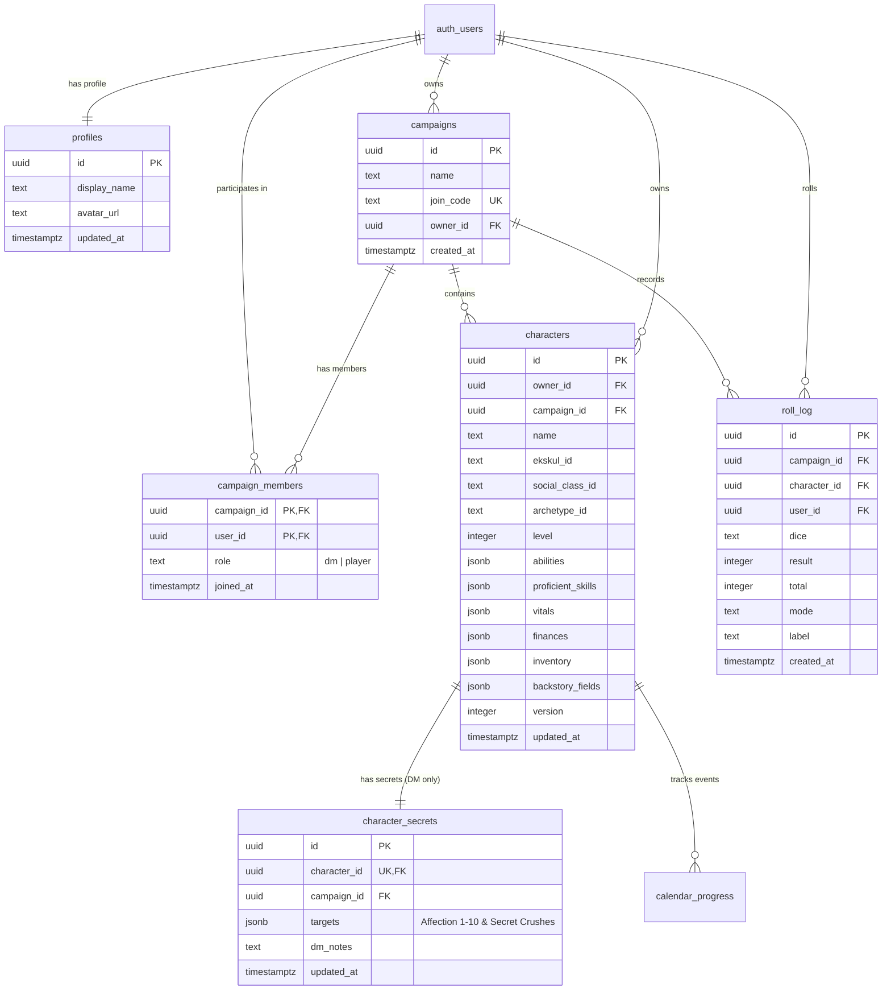

# Damsel & Desire — Production Architecture & Engineering Guide

> **Damsel & Desire: Japanese High School Romance TRPG (D&D 5e Alternative Chassis)**  
> Platform web *Character Vault, Builder Wizard, & Multi-Player Realtime Campaign* berskala production-grade. Dibangun dengan arsitektur **Vite + Vanilla TypeScript (Modular)**, backend serverless **Supabase PostgreSQL & Auth**, **Server-Side Game Engine (Postgres RPC)**, dan **Row-Level Security (RLS)** tanpa celah keamanan client-side.

---

## 1. Arsitektur Sistem Baru (To-Be Architecture)

Aplikasi telah direfaktor dari SPA monolitik *vibecoded* menjadi sistem production-grade dengan pemisahan tanggung jawab yang tegas (*separation of concerns*):



---

## 2. Diagram Relasi Entitas (Entity Relationship Diagram - ERD)



---

## 3. Matriks Keamanan & Row-Level Security (RLS)

| Tabel | SELECT Policy | INSERT Policy | UPDATE Policy | DELETE Policy |
| :--- | :--- | :--- | :--- | :--- |
| `profiles` | Publik (authenticated) | Pemilik akun (`auth.uid() = id`) | Pemilik akun | Pemilik akun |
| `campaigns` | Pemilik atau Anggota Campaign | Pengguna login | Pemilik atau DM Campaign | Pemilik |
| `campaign_members` | Sesama Anggota Campaign | Diri sendiri (join via code) | Hanya DM Campaign | Diri sendiri (keluar) / DM (kick) |
| `characters` | Pemilik atau Anggota Campaign | Pemilik (`auth.uid() = owner_id`) | Pemilik atau DM Campaign | Pemilik |
| **`character_secrets`** | **Hanya DM Campaign** (`role = 'dm'`) | **Hanya DM Campaign** | **Hanya DM Campaign** | **Hanya DM Campaign** |
| `roll_log` | Anggota Campaign | Anggota Campaign | DM Campaign | DM Campaign |
| `calendar_progress` | Pemilik / Anggota Campaign | Pemilik Karakter | Pemilik Karakter | Pemilik Karakter |
| `compendium_*` | Publik (Semua user) | Service Role (Admin) | Service Role | Service Role |

> [!CAUTION]
> **Penghapusan DM_PIN**: Hardcoded `DM_PIN` telah dihapus sepenuhnya dari codebase. Hak akses Game Master ditegakkan pada tingkat basis data oleh PostgreSQL RLS (`is_campaign_dm(campaign_id, auth.uid())`). Pemain biasa secara teknis tidak dapat menerima maupun membaca data dari tabel `character_secrets`.

---

## 4. Alur Kerja Server-Side Game Engine (Postgres RPC)

1. **`create_character(payload)`**:
   - Memvalidasi alokasi nilai atribut:
     - Mode Standard Array: Memastikan tepat menggunakan angka `[15, 14, 13, 12, 10, 8]` tanpa duplikasi.
     - Mode Point Buy: Memastikan batas rentang nilai 8–15 dan total biaya tidak melebihi 27 poin.
   - Membatasi pemilihan keahlian (*proficient skills*) maksimal 4 keahlian.
   - Menghasilkan paket perlengkapan 3-layer secara otomatis di server (Tas Sekolah + Latar Sosial + Ekskul Klub).
2. **`short_rest(character_id, client_version)`**:
   - Memvalidasi ketersediaan Rest Dice.
   - Melempar dadu pemulihan di server menggunakan secure RNG berbasis Hit Die klub ekskul + Mod Physique.
   - Menghalangi *race condition* dengan pengecekan kolom `version` (Optimistic Locking).
3. **`long_rest(character_id, client_version)`**:
   - Memulihkan Physical HP dan Composure secara penuh.
   - Mengisi ulang seluruh kuota Rest Dice.
   - **Otomatisasi Finansial**: Menyetor uang jajan harian dan gaji pekerjaan paruh waktu (*baito*) langsung ke saldo tabungan.
4. **`adjust_savings(character_id, delta_rupiah, client_version)`**:
   - Menghitung konversi kurs tetap TRPG (¥1 = Rp100) di server.
   - Menegakkan batas saldo tabungan tidak boleh negatif (`savingsAmount >= 0`).
5. **`roll_dice(campaign_id, character_id, dice, mode, label, modifier)`**:
   - Menghasilkan lemparan dadu acak di sisi server (mendukung Normal, Advantage, Disadvantage).
   - Menyimpan hasil ke `roll_log` dan menyiarkannya secara instan ke seluruh anggota campaign melalui Realtime WebSocket.

---

## 5. Struktur Modul Frontend (`/src`)

```
src/
├── api/
│   ├── auth.ts              # Supabase Auth: Magic Link & Google OAuth
│   ├── campaigns.ts         # Campaign CRUD & Join Code logic
│   ├── characters.ts        # Character CRUD & DM Secret Vault queries
│   ├── compendium.ts        # Cached compendium rules loader
│   ├── gameRpc.ts           # Remote Procedure Calls game engine
│   ├── storage.ts           # Upload foto avatar ke Supabase Storage
│   └── supabase.ts          # Inisialisasi Supabase JS Client
├── components/
│   ├── BackstoryModal.ts    # Dialog sunting backstory karakter
│   ├── BaitoModal.ts        # Dialog kelola kerja paruh waktu siswa
│   ├── DiceRollerModal.ts   # Dialog lempar dadu interaktif
│   ├── Navbar.ts            # Navigasi global dan status autentikasi
│   ├── SavingsModal.ts      # Dialog kalkulator tabungan Rp/Yen
│   ├── Skeleton.ts          # Shimmer loading skeleton UI
│   └── Toast.ts             # Sistem notifikasi toast
├── realtime/
│   └── campaignRealtime.ts  # Manajer langganan WebSocket per-campaign
├── router/
│   └── router.ts            # HTML5 History API Path Router & Route Guards
├── services/
│   ├── exporter.ts          # Validasi skema & Ekspor/Impor JSON + Print A4
│   └── ruleEngine.ts        # Kalkulator mod stat, point buy, & standard array
├── store/
│   ├── authStore.ts         # Reaktif state sesi & profil pengguna
│   ├── campaignStore.ts     # Reaktif state campaign aktif & peran DM
│   └── characterStore.ts    # Reaktif state sheet karakter & optimistic update
├── types/
│   └── index.ts             # Definisi antarmuka TypeScript lengkap
├── views/
│   ├── BuilderWizardView.ts # /characters/new (Wizard 6 langkah)
│   ├── CampaignDetailView.ts# /campaigns/:id (Roster campaign & live roll log)
│   ├── CampaignsView.ts     # /campaigns (Daftar & buat campaign)
│   ├── CharacterSheetView.ts# /characters/:id (Interactive sheet)
│   ├── CompendiumView.ts    # /compendium (Ensiklopedia aturan)
│   ├── DmDashboardView.ts   # /dm/:campaignId (DM Vault & Affection)
│   ├── LandingView.ts       # / (Beranda & Character Roster)
│   ├── LoginView.ts         # /login (Magic Link & OAuth)
│   ├── NotFoundView.ts      # 404 Page
│   └── SettingsView.ts      # /settings (Profil & avatar upload)
├── main.ts                  # Entrypoint aplikasi Vite
└── vite-env.d.ts            # Type declarations Vite environment
```

---

## 6. Panduan Setup Supabase Lokal & Migrasi

### Prasyarat
- Node.js v20+
- Docker (untuk menjalankan Supabase CLI lokal)

### 1. Menjalankan Supabase Lokal via CLI
```bash
# Inisialisasi Supabase jika belum
npx supabase init

# Menjalankan kontainer database Postgres lokal
npx supabase start

# Menjalankan seluruh file migrasi SQL
npx supabase db reset
```

### 2. Struktur Berkas Migrasi (`/supabase/migrations`)
1. `20261007000001_initial_schema.sql` — Tabel `profiles`, `campaigns`, `campaign_members`, `characters`, `character_secrets`, `roll_log`.
2. `20261007000002_compendium_tables.sql` — Tabel compendium (Ekskul, Moves, Archetypes, Actions, Events).
3. `20261007000003_seed_compendium.sql` — Data master 12 klub, 36 club moves, 8 archetypes, dan latar sosial.
4. `20261007000004_rls_policies.sql` — Aturan keamanan Row-Level Security di seluruh tabel.
5. `20261007000005_legacy_data_migration.sql` — Prosedur migrasi data karakter lama tanpa kehilangan data.
6. `20261007000006_game_logic_rpc.sql` — Fungsi Postgres RPC game engine dan validasi server-side.

### 3. Migrasi Data Karakter Lama (Retroaktif)
Jika Anda memiliki data karakter dari sistem lama:
- **Dari Tabel Supabase Lama (`legacy_characters`)**:
  Jalankan perintah SQL berikut di Supabase SQL Editor:
  ```sql
  CALL public.migrate_all_legacy_characters('<USER_UUID_TARGET>', '<CAMPAIGN_UUID_TARGET>');
  ```
- **Dari Penyimpanan Browser (`localStorage`)**:
  Pengguna cukup mengeklik tombol **"📥 Import Karakter (JSON)"** di halaman beranda setelah login; sistem akan otomatis memanggil fungsi RPC `import_legacy_character` untuk memigrasikan data ke skema baru beserta isolasi rahasia target DM.

---

## 7. Environment Variables (`.env`)

Buat berkas `.env` di direktori utama:

```env
# URL Instance Supabase
VITE_SUPABASE_URL=https://your-project-ref.supabase.co

# Anon Public Key Supabase (aman dipublikasikan ke client)
VITE_SUPABASE_ANON_KEY=eyJhbGciOiJIUzI1NiIsInR5cCI6IkpXVCJ9...
```

---

## 8. Menjalankan Proyek Secara Lokal & Testing

```bash
# 1. Instalasi dependensi
npm install

# 2. Menjalankan server pengembangan lokal (Vite)
npm run dev

# 3. Menjalankan type check TypeScript
npx tsc --noEmit

# 4. Menjalankan unit tests (Vitest)
npm test

# 5. Build aset produksi
npm run build
```

---

## 9. Panduan Deployment Produksi

Aplikasi siap di-*deploy* ke penyedia hosting statis modern seperti **Vercel**, **Netlify**, atau **Cloudflare Pages**.

### Konfigurasi Rewrite SPA (Fallback Routing)
Karena aplikasi menggunakan HTML5 History API (`/campaigns/:id`, `/characters/:id`), hosting harus meneruskan seluruh permintaan URL ke `index.html`.

- **Vercel (`vercel.json`)**:
  ```json
  {
    "rewrites": [{ "source": "/(.*)", "destination": "/index.html" }]
  }
  ```
- **Netlify (`public/_redirects`)**:
  ```text
  /*    /index.html   200
  ```

---

*Damsel & Desire — Production Architecture Release v2.0.*
